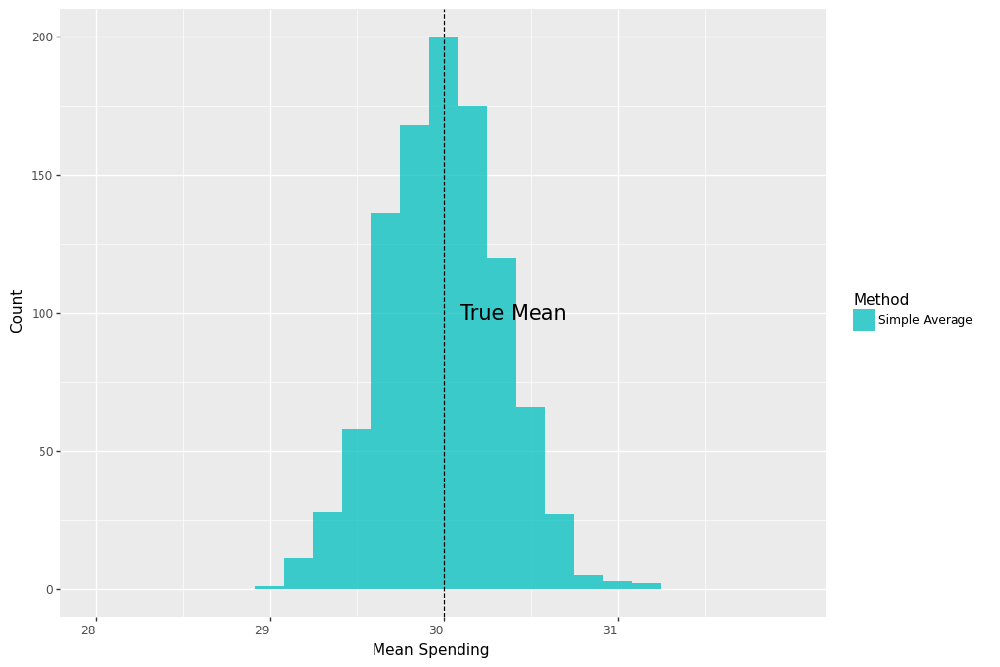
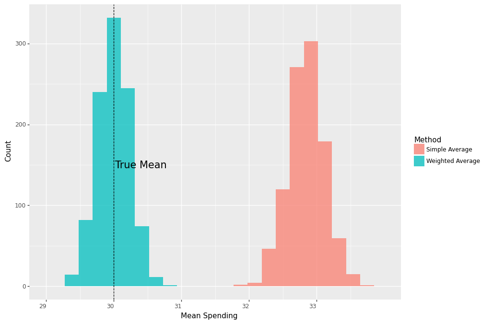

One of the well-established methods for causal inference is based on the Inverse Propensity Weighting (IPW). In this post we will use a simple example to build an intuition for IPW. Specifically, we will see how IPW is derived from a simple weighted average in order to account for varying treatment assignment rates in causal evaluation.

Let's consider the simple example where we want to estimate the average effect of running a marketing coupon campaign on customer spending. We run the campaign in two stores by randomly assigning a coupon to existing customers. Suppose both stores have same number of customers and, unknown to us, spending among treated customers is distributed as $N(20,3^2)$ and $N(40,3^2)$ in stores 1 and 2, respectively.

Throughout the example $Y_i(1)$ represents an individual’s spending if they receive a coupon, $T_i=1$, and $Y_i(0)$ represents their spending if they don't, $T_i=0$. These random variables are called potential outcomes. The observed outcome $Y_i$ is related to potential outcomes as follows: 

$$Y_i = Y_i(1)T_i + Y_i(0)(1-T_i)$$


Our estimand, the thing that we want to estimate, is the population mean spending given a coupon, $E[Y_i(1)]$. If we randomly assign coupons to the same number of customers in both stores, we can get an unbiased estimate of this by simply averaging the observed spending of the treated customers, which is $0.5*\$20 + 0.5*\$40 = \$30$. 

Mathematically, this looks as follows: 

$$\begin{align*}E[Y_i|T_i=1] &= E[Y_i(1)T_i + Y_i(0)(1-T_i)|T_i=1]\\
                             &= E[Y_i(1)|T_i=1]\\
                             &= E[Y_i(1)]
\end{align*}$$
where the first line is due to the potential outcomes, and the third line follows from random assignment of treatment, which makes potential outcomes independent of treatment assignment. $$Y_i(1), Y_i(0) \perp T_i$$ 

### Simple Average
Let's define a function that generates a sample of $2000$ customers, randomly assigns $50%$ of them to treatment in both stores, and records their average spending. Let's also run a simulation that calls this function for $1000$ times.

```python
def run_campaign(biased=False):
    true_mu1treated , true_mu2treated = 20 , 40
    n, p , obs = 1, .5 , 2000 # number of trials, probability of each trial, 
                              # number of observations
    store = np.random.binomial(n, p, obs)+1
    df = pd.DataFrame({'store':store})

    probtreat1 = .5
    if biased:
        probtreat2 = .9
    else:
        probtreat2 = .5
    
    treat = lambda x: int(np.random.binomial(1, probtreat1, 1))\
                   if x==1 else int(np.random.binomial(1, probtreat2, 1)) 
    
    spend = lambda x: float(np.random.normal(true_mu1treated, 3, 1))\
                   if (x[0]==1 and x[1]==1)\
                   else ( float(np.random.normal(true_mu2treated, 3, 1) ) )

    df['treated'] = df['store'].apply(treat)
    df['spend'] = df[['store','treated']].apply(tuple,1).apply(spend)
    
    simple_value_treated = np.mean(df.query('treated==1')['spend'])
        
    return [simple_value_treated]
```

```python
sim = 1000
values = Parallel(n_jobs=4)(delayed(run_campaign)() for _ in tqdm(range(sim)))
results_df = pd.DataFrame(values, columns=['simple_treat'])
```


The following plot shows us that the distribution of the average spending is centered around the true mean.




Now, suppose for some reason the second store assigned coupons to $90\%$ of the customers, whereas the first store assigned it to $50\%$. What happens if we ignore this and use the same approach as previously and take an average of all treated customers' spending? Because customers of the second store  have a higher treatment rate, their average spending will take a larger weight in our estimate and thereby result in an upward bias.

In other words, we no longer have a truly randomized experiment because the probability of receiving a coupon now depends on the store. Moreover, because treated customers in the two stores also have substantially different spending on average, the store a customer belongs to is a confounding variable in causal inference speak. 

Mathematically, if we use the simple average spending of treated customers, this time, instead of having this:

$$\begin{align*}E[Y_i|T_i=1] = E[Y_i(1)|T_i=1]= E[Y_i(1)]
\end{align*}$$

we end up with this:

$$\begin{align*}E[Y_i|T_i=1] = E[Y_i(1)|T_i=1]> E[Y_i(1)]
\end{align*}$$

Indeed, repeating the simulation and plotting the results, we see that the distribution of the average spending is now centered far from the true mean.

```python
sim = 1000
values = Parallel(n_jobs=4)(delayed(run_campaign)(biased=True) for _ in tqdm(range(sim)))
results_df = pd.DataFrame(values, columns=['simple_treat'])
```


### Weighted Average
All is not lost, however. Since we know that our experiment was messed up because assignment rates were different between stores, 
we can correct it by taking a weighted average of treated customers' spending, where weights represent the proportion of customers in each store. This means, we can reclaim random assignment of treatment once we condition on the store information, 

$$Y_i(1), Y_i(0) \perp T_i|X_i$$
where $X_i \in \lbrace{S_1,S_2\rbrace}$ represents store membership of customer $i$, and obtain unbiased estimates of our causal estimand, $E[Y_i(1)]$.

The math now works as follows:

$$\begin{align*}E[Y_i(1)] =& E[E[Y_i(1)|X_i]]\\
                          =& E[E[Y_i(1)|T_i=1,X_i]]\\
                          =& E[Y_i|T_i=1,X_i=S_1] p(X_i=S_1)+\\
                          & E[Y_i|T_i=1,X_i=S_2] p(X_i=S_2)
\end{align*}$$

where the first equation is due to the law of iterated expectations and the second one is due to conditional independence.

Let $n_1$ and $n_2$ denote the number of customers in both stores. Similarly, let $n_{1T}$  and $n_{2T}$ represent the number of treated customers in both stores. Then the above estimator can be computed from the data as follows:

$$\begin{equation} \underbrace{(\frac{n_1}{n})}_{\text{Prop. of cust. in }S_1}  \underbrace{\frac{1}{n_{1T}}\sum_{i \in S_{1}, i \in T} Y_i}_{\text{Mean spending of treated in }S_1} + \underbrace{(\frac{n_2}{n})}_{\text{Prop. of cust. in }S_2} \underbrace{\frac{1}{n_{2T}}\sum_{i \in S_{2}, i \in T} Y_i}_{\text{Mean spending of treated in }S_2} \end{equation}$$ 

Sure enough, if we repeat the previous sampling process 

```python
def run_campaign2():
    true_mu1treated , true_mu2treated = 20, 40

    n, p , obs = 1, .5 , 2000 # number of trials, probability of each trial, 
                              # number of observations
    store = np.random.binomial(n, p, obs)+1
    df = pd.DataFrame({'store':store})

    probtreat1 = .5
    probtreat2 = .9
    
    treat = lambda x: int(np.random.binomial(1, probtreat1, 1)) 
                   if x==1 else int(np.random.binomial(1, probtreat2, 1)) 
    
    spend = lambda x: float(np.random.normal(true_mu1treated, 3, 1)) 
                   if (x[0]==1 and x[1]==1) 
                   else ( float(np.random.normal(true_mu2treated, 3, 1) ) )

    df['treated'] = df['store'].apply(treat)
    df['spend'] = df[['store','treated']].apply(tuple,1).apply(spend)
    
    simple_value_treated = np.mean(df.query('treated==1')['spend'])
    
    prob1 = df.query('store==1').shape[0]/df.shape[0]
    prob2 = df.query('store==2').shape[0]/df.shape[0]
    
    est_mu1treated = np.mean(df.query('treated==1 & store==1')['spend'])
    est_mu2treated = np.mean(df.query('treated==1 & store==2')['spend'])

    weighted_value_treated = prob1*est_mu1treated + prob2*est_mu2treated
    
    return [simple_value_treated, weighted_value_treated]

```

```python
sim=1000
values = Parallel(n_jobs=4)(delayed(run_campaign2)() for _ in tqdm(range(sim)) )
results_df = pd.DataFrame(values, columns=['simple_treat','weighted_treat'])
```
we see that the average of weighted averages is again right on the true mean.


Let's now do some algebraic manipulation by rewriting the mean spending in store 1: 

$$\frac{1}{n_{1T}}\sum_{i \in S_{1}, i \in T} Y_i = \frac{1}{n_1} \sum_{i \in S_{1}, i \in T} \frac{Y_i}{(n_{1T}/n_1)} = \frac{1}{n_1} \sum_{i \in S_{1}} \frac{T_i }{(n_{1T}/n_1)}Y_i$$
Doing the same for store 2 and plugging them back into (1) we have the following:

$$\begin{equation}(\frac{n_1}{n})\frac{1}{n_1} \sum_{i \in S_{1}} \frac{T_i }{(n_{1T}/n_1)}Y_i  + (\frac{n_2}{n}) \frac{1}{n_{2}}\sum_{i \in S_{2}} \frac{T_i }{(n_{2T}/n_2)}Y_i\end{equation}$$ 
Denote the proportion of treated customers in store 1 as $p(S_{1i}) = (n_{1T}/n_1)$ and similarly for store 2, then we can simplify (2) into:

$$ \begin{equation}\frac{1}{n} \sum^n_{i=1}\frac{T_i}{p(X_i)}Y_i \end{equation}$$, where $p(X_i)$ is the probability of receiving treatment conditional on the confounding variable, aka __the propensity score__,

$$p(X_i) = P[T_i = 1 |X_i]$$

Notice, we started with one weighted average and ended up with just another weighted average that uses $\frac{T_i}{p(X_i)}$ as weights. This is the well-known __inverse propensity weighted estimator__.

Running the previous analysis with this estimator

```pyhton
def run_campaign3():
    true_mu1treated , true_mu2treated = 20, 40

    n, p , obs = 1, .5 , 2000 # number of trials, probability of each trial, number of observations
    store = np.random.binomial(n, p, obs)+1
    df = pd.DataFrame({'store':store})

    probtreat1 = .5
    probtreat2 = .9
    
    treat = lambda x: int(np.random.binomial(1, probtreat1, 1)) 
                   if x==1 else int(np.random.binomial(1, probtreat2, 1)) 
    
    spend = lambda x: float(np.random.normal(true_mu1treated, 3, 1)) 
                   if (x[0]==1 and x[1]==1) 
                   else ( float(np.random.normal(true_mu2treated, 3, 1) ) )

    df['treated'] = df['store'].apply(treat)
    df['spend'] = df[['store','treated']].apply(tuple,1).apply(spend)
    
    prob1 = df.query('store==1').shape[0]/df.shape[0]
    prob2 = df.query('store==2').shape[0]/df.shape[0]
    
    simple_value_treated = np.mean(df.query('treated==1')['spend'])
    
    #estimate propensity score:
    ps1 = df.query('treated==1 & store==1').shape[0]/df.query('store==1').shape[0]
    ps2 = df.query('treated==1 & store==2').shape[0]/df.query('store==2').shape[0]

    df['ps'] = pd.Series(np.where(df['store']==1, ps1, ps2))

    ipw_value_treated = np.mean( (df['spend']*df['treated'])/df['ps'])
    
    return [simple_value_treated, ipw_value_treated]
```
```python
sim=1000
values = Parallel(n_jobs=4)(delayed(run_campaign3)() for _ in tqdm(range(sim)) )
results_df = pd.DataFrame(values, columns=['simple_treat','ipw_treat'])
```

give us the same unbiased estimate as before.


### Estimating the Average Treatment Effect 


Now, our ultimate goal is to learn the average incremental spending that the marketing campaign has generated, aka the average treatment effect. To do that we need to also estimate the the population mean spending not given a coupon, $E[Y_i(0)]$ and compare it against $E[Y_i(1)]$. Our estimand is now this:

$$\tau = E[Y_i(1)] - E[Y_i(0)] $$
Towards this, first we repeat the same argument for non-treated and obtain an unbiased estimate for $E[Y_i(0)]$ as follows:

$$ \begin{equation*}\frac{1}{n} \sum^n_{i=1}\frac{(1-T_i)}{1-p(X_i)}Y_i \end{equation*}$$
and finally combine them into estimating $\tau$:

$$\hat{\tau} = \frac{1}{n} \sum^n_{i=1}\frac{T_i}{p(X_i)}Y_i - \frac{1}{n} \sum^n_{i=1}\frac{(1-T_i)}{1-p(X_i)}Y_i$$


Let's now extend our previous analysis into estimating the impact of the campaign. Suppose spending among non-treated customers is distributed as $N(10,2^2)$ and $N(30,2^2)$ in stores 1 and 2, respectively, so that the true effect of the campaign is $\$10$ in both stores, and therefore we have $\tau = \$10$. 

```python
def run_campaign4():
    true_mu1treated , true_mu2treated = 20, 40
    true_mu1control , true_mu2control = 10, 10
    n, p , obs = 1, .5 , 2000 # number of trials, probability of each trial, number of observations
    store = np.random.binomial(n, p, obs)+1
    df = pd.DataFrame({'store':store})
    probtreat1 = .5
    probtreat2 = .9
    
    treat = lambda x: int(np.random.binomial(1, probtreat1, 1)) 
                   if x==1 else int(np.random.binomial(1, probtreat2, 1)) 
    
    spend = lambda x: float(np.random.normal(true_mu1treated, 3, 1)) 
                   if (x[0]==1 and x[1]==1) 
                   else ( float(np.random.normal(true_mu2treated, 3, 1) ) 
                   if  (x[0]==2 and x[1]==1)   
                   else (float(np.random.normal(true_mu1control, 2, 1) ) 
                   if  (x[0]==1 and x[1]==0)  
                    else  float(np.random.normal(true_mu2control, 2, 1)) )
                                                                                    
    df['treated'] = df['store'].apply(treat)
    df['spend'] = df[['store','treated']].apply(tuple,1).apply(spend)
    
    prob1 = df.query('store==1').shape[0]/df.shape[0]
    prob2 = df.query('store==2').shape[0]/df.shape[0]
    
    simple_value_treated = np.mean(df.query('treated==1')['spend'])
    simple_value_control = np.mean(df.query('treated==0')['spend'])
    
    simple_tau = simple_value_treated - simple_value_control
    
    est_mu1treated = np.mean(df.query('treated==1 & store==1')['spend'])
    est_mu2treated = np.mean(df.query('treated==1 & store==2')['spend'])
    weighted_value_treated = prob1*est_mu1treated + prob2*est_mu2treated
        
    est_mu1control = np.mean(df.query('treated==0 & store==1')['spend'])
    est_mu2control = np.mean(df.query('treated==0 & store==2')['spend'])
    
    weighted_value_control = prob1*est_mu1control + prob2*est_mu2control
    weighted_tau = weighted_value_treated - weighted_value_control
    
    #estimate propensity score:
    ps1 = df.query('treated==1 & store==1').shape[0]/df.query('store==1').shape[0]
    ps2 = df.query('treated==1 & store==2').shape[0]/df.query('store==2').shape[0]
    
    df['ps'] = pd.Series(np.where(df['store']==1, ps1, ps2))
    
    ipw_value_treated = np.mean( (df['spend']*df['treated'])/df['ps'])
    ipw_value_control = np.mean( (df['spend']*(1-df['treated']) )/(1-df['ps'] ))
    ipw_tau = ipw_value_treated - ipw_value_control
    
    return [simple_tau, weighted_tau, ipw_tau]
```

```python
sim=1000
values = Parallel(n_jobs=4)(delayed(run_campaign4)() for _ in tqdm(range(sim)) )
results_df = pd.DataFrame(values, columns=['simple_tau','weighted_tau','ipw_tau'])
```
As shown below, both the weighted average and the IPW estimator are centered around the true effect of $\$20$, whereas the distribution of the simple average without controlling for store membership is centered around $\$23$, $\%15$ larger than the true effect.


    
### Conclusion
The IPW estimator has a long history in causal inference. The goal of this post was to develop an intuition for this well-known estimator through a simple example. Using a marketing case we have seen that the hallmark of this method is to correct for unequal treatment assignment mechanisms. Moreover, we have shown that the method is an extension of the weighted average estimator.

### References

[1] Richard K. Crump, V. Joseph Hotz, Guido W. Imbens, Oscar A. Mitnik. [Dealing with limited overlap in estimation of average treatment effects.](https://academic.oup.com/biomet/article-abstract/96/1/187/235329?redirectedFrom=fulltext&login=false) (2009), _Biometrika_.

[2] Stefan Wager, [Stats 361: Causal Inference](https://web.stanford.edu/~swager/stats361.pdf) (Spring 2020), _Stanford University_.
