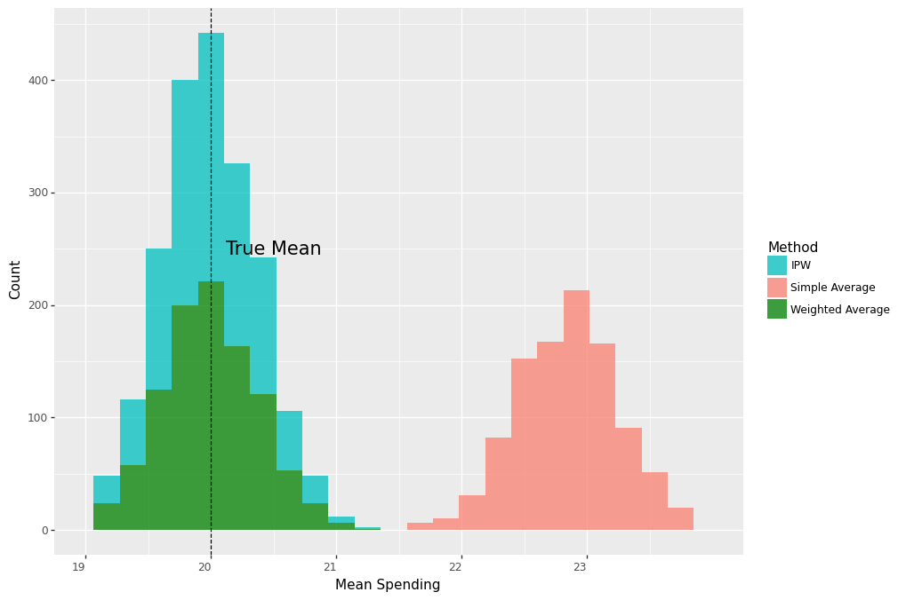

One mistake I come across repeatedly in campaign measurement is the following:

Let's suppose When $a \ne 0$, there are two solutions to $(ax^2 + bx + c = 0)$ and they are 

## Create Campaign Data

Both stores have same number of members. We can get an unbiased estimate of the population mean spending among customers if the number of treated is the same in both stores.

## Run Simulation

## Plot Results

    

    

    

    

    

    

