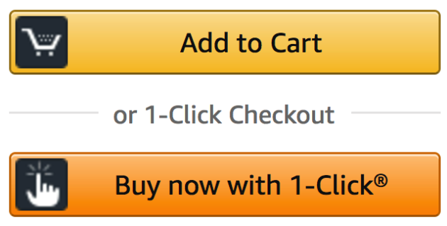

<b>Figure 1.</b> 1-Click Algorithm.

## Abstract 

E-commerce retailers are increasingly faced with challenges of finding ways to provide a seamless shopping experience to customers. The checkout process and its related touch points are especially critical in shaping the customer experience. We study the impact of adopting one-click buying, a feature that reduces the number of steps required to place a purchase order to a single click, on subsequent customer behavior. Using quasi-experimental data over a period of 35 months from an online retailer before and after the launch of one-click buying, we find adopting one-click buying is effective in lifting customer purchases and does so by making treated customers purchase more often as well as more items. The impact of adopting one-click buying on customer purchases post adoption is economically significant, persistent over time, and heterogeneous across customers. Analyzing clickstream data of customer activity online and purchases across product categories, we provide evidence that the increase in purchases is driven by richer engagement through both more visits to the website and more page views upon visit as well as the expansion of purchases across categories. We discuss the implications of our findings for customer experience and targeting.